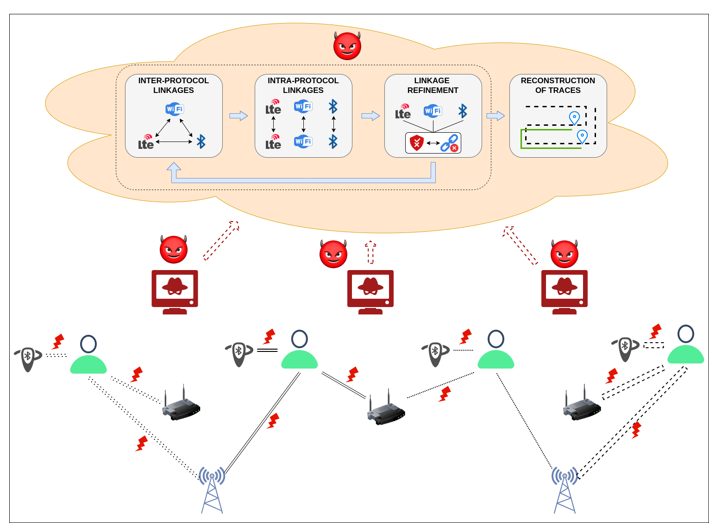

# CrossLink: Breaking Location Privacy by Linking Device Identifiers Across Protocols

---

Official Repository for the paper titled "CrossLink: Breaking Location Privacy by Linking Device Identifiers Across Protocols" 



Adversary can sniff the user data through multiple protocols like Bluetooth, WiFi, and LTE.  The sniffed data from all the sniffers would be sent to the tracking algorithm present at the backend. The sniffed data would consists of identifiers of all protocols and the probable distance between the sniffer and the measured user location. The adversary through the tracking algorithm would perform following steps:

1) Create inter-links of the identifiers from each sniffer based on the localization error and user mobility. (Maintain a list of not possible inter-linkages. Discard any linkages if linkages exists in not possible inter-linkages.)
2) Create intra-links of the identifiers based on if new identifiers of same protocol are present at the consecutive timestep. (Maintain a list of not possible intra-linkages. Discard any linkages if linkages exists in not possible intra-linkages.)
3) Refine the inter-linkages with help of intra-linkages and refine the intra-linkages with help of updated inter-linkages.
4) Store and utilize this linkage data for the next timesteps as the data is sent by the sniffer at every timestep.
5) Finally, reconstruct the user location traces after sometime to measure the privacy leakage of the users.

---

Here is a brief introduction to start with the code. 

## Hardware
Our code works on most of the hardware settings. However, for efficiency and speed, we recommend Core i7 CPUs and memory (Atleast 16GB+) and disk size of 100GB. We ran our code on 11th Gen Intel Core i7-1165G7 @2.80Ghz Processor. Overall memory of our system was 32Gb with operating system Ubuntu 22.04LTS and disk space of 2TB. The CPU Blowfish benchmarks scored 1.33.

## Package Dependency
The requirements for the code are listed in the ```pyproject.toml```. These requirements require poetry package to be installed. ```pip3 install poetry```.
Once the poetry tool is installed, the packages can be installed using ```poetry install``` command and then using ```poetry shell```, the temporary shell can be invoked to run the code.

## Repository structure

The repository structure can be found in the ```misc/detailed_readme.md```

## TODO before you start
0) Clone the repository with 
```bash
https://projects.cispa.saarland/c01mrsi/path-leakage.git
```
and checkout the branch ```feature/parser``` with command:
```bash
git checkout feature/parser
```

1) Check the ```<config file name>.yml``` file which you make. This file contains the conigurations required for the simulation setup.

2) Install mongodb through the [official website](https://www.mongodb.com/docs/manual/tutorial/install-mongodb-on-ubuntu/).

3) Check if the mongodb service is enabled. For ubuntu, this can be checked via ```sudo systemctl status mongod```

4) For every scenarios configured through the yml file, the yml file name would become the database name where the respective collections would be added. 

5) The code consists of various scripts in the folders namely group, tracking, sumo, sanity, reconstruction. While these scripts could run individual by prescribing the environment variables, these scripts are stitched using the ```main.py``` and ```pipeline.py```. The ```main.py``` used **setuptools** to create various pipelines as showcased in ```pipeline.py```. For future purpose, more such pipeline functions can be added to ```pipeline.py```.

6) Code utilizes SuMO simulation package and the configurations used for the setup are located in the ```scenario``` folder at the root of the repository.

## Simulation Setup

To ensure our readers have an understand of the code, we will try to follow an example.

#### 1. Initialization

First we configure the ```project.yml``` file. All the below mentioned environment variables are part of this config file. This would be situated in the code folder of the repository. 

To understand the argument params, the command used would be:
```bash 
python3 main.py -h
```

To know the pipelines for running the code, run the command
```bash
python3 main.py -c project.yml -t help
```

Clean any older files in ```log, images, pdf, csv folders``` with command:
```bash
python3 main.py -c project.yml -t clean_all
```

To only clean pycache, run 
```bash
python3 main.py -c project.yml -t clean
```

**(Ensure that the shell path is situated in the code folder and not in the root folder to run the code.)**.

#### 2. Data Generation Phase

##### 2.1 Sumo Simulation (Raw data generation)

The environment variables required are ```POLYGON_COORDS``` and ```USER_TIMESTEPS``` for running the sumo simulation code. Here the user movements data would generated.

This can be run with the command
```bash
python3 main.py -c project.yml -t sumo
```

With this command, the file with name ```raw_user_data_<config filename>.csv``` would be created.
Here for ```project.yml```, ```raw_user_data_project.csv``` file would be created in the ```data/``` folder.


##### 2.2 User data generation

To generate user data based on this obtained sumo simulation data, we require to configure following env variables: 

Parameters to set transmission interval are:
```BLUETOOTH_MIN_TRANSMIT,BLUETOOTH_MAX_TRANSMIT,WIFI_MIN_TRANSMIT,WIFI_MAX_TRANSMIT,LTE_MIN_TRANSMIT,LTE_MAX_TRANSMIT```  for Bluetooth, WiFi and LTE protocols.

Parameters to set randomization interval are: 
```BLUETOOTH_MIN_REFRESH,BLUETOOTH_MAX_REFRESH,WIFI_MIN_REFRESH,WIFI_MAX_REFRESH,LTE_MIN_REFRESH,LTE_MAX_REFRESH``` for Bluetooth, WiFi and LTE protocols.

Parameters to enable synced randomization (Randomization at the same time) are: ```ENABLE_SYNCED_RANDOMIZATION, PROTOCOL_MIN_REFRESH, PROTOCOL_MAX_REFRESH```.

Apart from these params, few generic parameters to set are:
```DATA_USECASE```: here to run our scenario on previous ```raw_user_data_<config filename>.csv``` config file, ```DATA_USECASE = <config filename>```
For our usecase, ```DATA_USECASE = project```.
Users get added after every timesteps. To ensure that we want only a particular amount of users or less in the simulation, we should use ```ENABLE_USER_THRESHOLD, TOTAL_NUMBER_OF_USERS```.
The ```MAX_MOBILITY_FACTOR``` ensures the max mobility of the users that could be captured. By setting this, any users beyond the max mobility would be filtered.

To generate user data, we can run the command
```bash
python3 main.py -c project.yml -t generate_user_data
```

With this command, the file with name ```user_data_<config filename>.csv``` would be created.
Here for ```project.yml```, ```user_data_project.csv``` file would be created in the ```data/``` folder.


> Note: This is RAM intensive (as the code is not optimized). The SUMO data gets loaded in the memory and for filtering, multiple copies are made in the memory.


##### 2.3 Sniffer data generation

To generate the sniffer, first we need to check the sniffer placements. To generate the sniffer location coordinates, one can directly run 
```bash
python3 services/sl_coordinates.py
```
To enable diverse range of polygon co-ordinates, the required editing can be performed in ```service/sl_coordinates.py``` file.
Alternatively, we provide ```full_coverage_ble_sniffer_location.json```, ```full_coverage_wifi_sniffer_location.json``` and ```partial_coverage_sniffer_location.json``` files in the ```data``` folder.

These files can be directly used for generating the sniffer data.

For generating the sniffer data, we need to set the following parameters:

Parameters for Protocol Range are: ```BLUETOOTH_RANGE, WIFI_RANGE, LTE_RANGE``` 

For parallel processing we split the user data into batches. Thus, we need to set ```SNIFFER_PROCESSING_BATCH_SIZE```.

Apart from this, we need to also set the protocols that sniffer can sniff through with:```ENABLE_BLUETOOTH, ENABLE_WIFI, ENABLE_LTE```.

If we need to use ```partial_coverage_sniffer_location.json```, we need to set ```ENABLE_PARTIAL_COVERAGE```.

Once we have set the parameters, we can generate the sniffer data through command
```bash
python3 main.py -c project.yml -t generate_sniffer_data
```
With this command, the file with name ```sniffed_data_<config filename>.csv``` would be created.
Here for ```project.yml```, ```sniffed_data_project.csv``` file would be created in the ```data/``` folder.

##### 2.4 Importing data to MongoDB

Once this data is generated, we can now push this to the MongoDB through the command:
```bash
python3 main.py -c project.yml -t import_data_mongo
```

Once data is imported, we can find the sniffed_data and user_data collections created under the file_name (Database name). For our case, we will have database name - project.


To automate 2.2 - 2.4, we can directly run command
```bash
python3 main.py -c project.yml -t user_data
```

To clean all data and generate from fresh - all the data from task 2.1 to 2.4, we can directly run command 
```bash
python3 main.py -c project.yml -t data_gen
```

#### 3. Data Aggregation Phase

Data aggregation phase consists of
- Aggregation by sniffers
- Aggregation by users
- Aggregation by timesteps '''

First we parsed and add content to the sniffed_data by running ```group/aggregate_sniffer_timesteps.py```
Then we aggregate through ```group/aggregation.py```.

Both these procedures are run with command:
```bash
python3 main.py -c project.yml -t aggregate
```

Once the aggregation is completed, we will have the following collections found in our database ```project``:
```aggregate_timesteps```, ```aggregate_users```, ```aggregated_sniffer```.


#### 4. Grouping Phase

To generate initial set of inter-protocol linkages, we would run the grouping python files.

Here we would be required to set the following parameters:

Parameter to set the Localization Error are: ```BLUETOOTH_LOCALIZATION_ERROR```, ```WIFI_LOCALIZATION_ERROR```, ```LTE_LOCALIZATION_ERROR```.

Additionally if we wish to use Multilateration, we should set it to true else false.

Parameter for multilateration is ```ENABLE_MULTILATERATION```.

To run single protocol grouping, we enable multi-lateration by default.

For multi-protocol, we would run the command:

```bash
python3 main.py -c project.yml -t group_multi
```

We would have the collection ```groups``` added the database.

For single-protocol, we would run the command:

```bash
python3 main.py -c project.yml -t group_smart
```

We would have the collection ```groups_smart``` added the database.

#### 5. Tracking Phase

Similarly for tracking, we would run the single protocol or multi-protocol.

For multi-protocol, we would run the command:

```bash
python3 main.py -c project.yml -t tracking_multi
```

For single-protocol, we would run the command:

```bash
python3 main.py -c project.yml -t tracking_smart
```


To run the grouping and tracking phase (Phase 4 ad Phase 5 together)

We can run the following command from the pipeline.

For multi-protocol -
```bash
python3 main.py -c project.yml -t multi
```

For single protocol -
```bash
python3 main.py -c project.yml -t smart
```

#### 6. Sanity check

Here, we apply three sanity checks to verify that the algorithm that we developed has any errors or not.


##### 6.1 Group checker

This check counts the groups with single protocol identifer and the groups with multiprotocol identifers

This helps to verify if there are any single mappings found during the initial interlinks creation

We run this using the command:
```bash
python3 main.py -c project.yml -t group_checker
```

##### 6.2 Incompatible Group checker

This checks whether the incompatible list created during the grouping, consists of any identifiers with same user id corresponding to their identifiers.
If any then counts and prints them

We run this using the command:
```bash
python3 main.py -c project.yml -t sanity_incompatible
```

To run 6.1 and 6.2 together, we run the pipeline command:

```bash
python3 main.py -c project.yml -t sanity_group
```

##### 6.3 Sanity Report

This check provides details on the overall users and corresponding metrics for inter and intra links created.

We run this using the command:
```bash
python3 main.py -c project.yml -t sanity
```


#### 7. Reconstruction

Once we have received the linkages through tracking. We will create user traces through reconstruction.

##### 7.1 Reconstruct the user data

This is a prior data preparation step.

Where we add the start timestep and final timestep of a user by merge aggregate timestep collection to aggregate user collection.

We run the command:
```bash
python3 main.py -c project.yml -t reconstruction_user_data
```


##### 7.2 Reconstruct baseline data

Here we reconstruct the baseline (single protocol without localization)

We run the command:
```bash
python3 main.py -c project.yml -t reconstruction_baseline
```

##### 7.3 Reconstruct multi protocol

To reconstruct multi protocol
We run the command:
```bash
python3 main.py -c project.yml -t reconstruction_multi
```
##### 7.4 Reconstruct single protocol

To reconstruct single protocol, we run the command:
```bash
python3 main.py -c project.yml -t reconstruction_baseline_smart
```

> Note: For running single protocol or multi protocol, we need to run the baseline first as it prepares data necessary for running these pipelines.

##### 7.5 Reconstruct partial coverage (for multi protocol)

To reconstruct during partial coverage scenario, we run the command
```bash
python3 main.py -c project.yml -t partial_reconstruction
```

To automate step 7.1, 7.2, 7.3, we run the command:
```bash
python3 main.py -c project.yml -t reconstruction_without_smart
```

Finally after reconstruction, the files would be present in ```csv/``` folder.

For baseline, the files would named as:

```baseline_<protocol>_<config file name>.yml```

In our case, it would be for example:
```baseline_ble_project.csv```, ```baseline_wifi_project.csv```, ```baseline_lte_project.csv```

For single protocol, the files would named as:

```baseline_smart_<protocol>_<config file name>.yml```

In our case, it would be for example:
```baseline_smart_ble_project.csv```, ```baseline_smart_wifi_project.csv```, ```baseline_smart_lte_project.csv```

For multi protocol,
we have the file names:
```multi_protocol_<config file name>.yml```

In our case, it would be:
```multi_protocol_project.yml```


#### 8. Plotting the graphs

Once we have reconstructed and found the user traces, we plot the cdf graph for it.

This can be done using the command:
```bash
python3 main.py -c project.yml -t plot
```
The plots would be present in the ```images/``` folder
